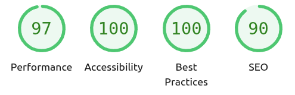

<div align="center">

# g-sui — Go Server‑Rendered UI

Build interactive, component‑styled pages in Go with server actions, simple partial updates, and no client framework.

</div>

---

See documentation at [`docs/DOCUMENTATION.md`](docs/DOCUMENTATION.md) for a comprehensive reference guide and architecture documentation. See [`examples/`](examples/) for working examples.

**Claude Code users**: Install the [g-sui skills](#claude-code-skills) to help Claude understand the framework better.

## Highlights

- Server-rendered HTML components with a small helper DSL
- Lightweight interactivity via server actions (`Click`, `Submit`, `Send`)
- Partial updates: re-render, replace, append, or prepend only the target
- Smooth navigation with background loading and delayed loader (50ms threshold) via `ctx.Load()`
- **Parameterized routes** with path parameters (`/user/{id}`) and query parameters (`?name=Smith`) - works seamlessly with SPA navigation
- Built-in PWA support with manifest and service worker generation (`app.PWA()`)
- Deferred fragments with skeletons via WebSocket patches (`ctx.Patch` + skeleton helpers)
- Query/Collate helper for data UIs: search, sort, filters, paging, and XLS export (works with `gorm`)
- Form helpers with validation (uses `go-playground/validator`)
- A small set of UI inputs (text, email, phone, password, number, date/time/datetime, select, checkbox, radio, radio cards, textarea), buttons, tables, icons
- Toast messages: `Success`, `Error`, `Info`, and an error toast with a Reload button
- Built-in live status via WebSocket (`/__ws`) with an offline banner, automatic reconnect, and auto-reload on reconnect
- Built-in dark mode with a tiny theme switcher (`ui.ThemeSwitcher`) cycling System → Light → Dark
- Optional dev autorestart (`app.AutoRestart(true)`) to rebuild and restart on changes

## Lighthouse snapshot



The bundled example app scores 97 for Performance, 100 for Accessibility, 100 for Best Practices, and 90 for SEO when audited with Lighthouse. These scores come from a local run against the default demo and showcase how the server-rendered approach keeps the experience fast and accessible out of the box.

## Install

```bash
go get github.com/michalCapo/g-sui
```

Go 1.21+ recommended (module currently targets Go 1.23 toolchain).

## Quick start

```go
package main

import (
    "github.com/michalCapo/g-sui/ui"
)

func main() {
    app := ui.MakeApp("en")
    
    app.Page("/", func(ctx *ui.Context) string {
        return app.HTML("Hello World", "bg-gray-100", 
            ui.Div("p-8")(
                ui.Div("text-2xl font-bold")("Hello World"),
            ),
        )
    })
    
    app.Listen(":8080")
}
```

Run and open http://localhost:8080

### Favicon (optional)

If you have a favicon, serve it with caching and add a link tag:

```go
// embed your assets
//go:embed assets/*
var assets embed.FS

app.Favicon(assets, "assets/favicon.svg", 24*time.Hour)
app.HTMLHead = append(app.HTMLHead, `<link rel="icon" href="/favicon.ico" type="image/svg+xml">`)
```

The server sets the proper Content-Type for common favicon formats (including `image/svg+xml`).

## Examples

This repo ships an example app showcasing most components and patterns.

Run the examples server:

```bash
go run examples/main.go
```

The examples include:
- **Component Showcase**: Alerts, Badges, Cards, Progress Bars, Tooltips, Tabs, Accordion, Dropdown Menus
- Showcase form with validations
- Inputs: text/email/phone/password/number/date/time/datetime/textarea/select/checkbox/radio/radio cards
- Buttons and color variants (solid/outline)
- Tables with simple helpers (including colspan and empty cells)
- Icons helpers and Hello demo (success/info/error/crash)
- Markdown rendering and a CAPTCHA demo
- **Route Parameters**: Path parameters (`/user/{id}`) and query parameters (`?name=Smith`) examples
- Query demo: in-memory SQLite + GORM with `ui.TCollate` (search, sort, filters, paging, XLS export)
- Append/Prepend demo for list updates
- Clock demo and deferred fragments (skeleton → WS patch)
- Navigation bar that highlights the current page based on the URL path

### Smooth Navigation

g-sui provides smooth, SPA-like navigation with background loading and a smart loader that only appears if the fetch takes longer than 50ms.

Use `ctx.Load()` for smooth navigation on links:

```go
ui.A(cls, ctx.Load(r.Path))(r.Title)
```

This creates a link that:
- Fetches the page in the background on click
- Shows a loader only if the fetch takes longer than 50ms
- Replaces the page content seamlessly without a full reload
- Updates the browser history and title

#### Active Navigation Highlight

The examples' top navigation highlights the last selected page (the current route) without any extra state. Compare each route path to `ctx.Request.URL.Path` and choose classes accordingly:

```go
// inside a layout callable
ui.Map(routes, func(r *route, _ int) string {
    base := "px-2 py-1 rounded text-sm whitespace-nowrap"
    cls := base + " hover:bg-gray-200"
    if ctx != nil && ctx.Request != nil && r.Path == ctx.Request.URL.Path {
        cls = base + " bg-blue-700 text-white hover:bg-blue-600"
    }
    return ui.A(cls, ctx.Load(r.Path))(r.Title)
})
```

## Progressive Web App (PWA)

g-sui provides built-in support for Progressive Web Apps, allowing your application to be installed on mobile and desktop devices. Enable it by providing a config:

```go
app.PWA(ui.PWAConfig{
    Name:                  "My App",
    ShortName:             "App",
    Description:           "My awesome g-sui app",
    ThemeColor:            "#1d4ed8",
    BackgroundColor:       "#ffffff",
    GenerateServiceWorker: true,
    CacheAssets:           []string{"/assets/app.css", "/assets/app.js"}, // Assets to pre-cache
    OfflinePage:           "/offline",                                     // Fallback when offline
})
```

This automatically:
- Generates and serves `/manifest.webmanifest` with proper JSON formatting
- Generates and serves `/sw.js` (Service Worker) with smart caching
- Adds necessary meta tags and manifest link to the `<head>`
- Registers the service worker in the browser automatically

The service worker provides:
- **Network-first for pages**: Always fresh content from server, cache as offline fallback
- **Cache-first for assets**: Fast loading for files in `CacheAssets`
- **Auto-versioning**: New cache on each server restart, old caches auto-cleaned
- **Immediate activation**: `skipWaiting()` + `clients.claim()` for instant updates

## Server actions and partial updates

Attach server actions via:

- `ctx.Call(fn).Render(target)` – replace inner HTML of `target`
- `ctx.Call(fn).Replace(target)` – replace the element itself
- `ctx.Call(fn).Append(target)` – insert HTML at the end of the target
- `ctx.Call(fn).Prepend(target)` – insert HTML at the beginning of the target
- `ctx.Call(fn).None()` – fire and forget (no swap)

On the server, an action has the signature `func(*ui.Context) string` and returns HTML (or an empty string if not swapping anything).

Forms can use `ctx.Submit(fn).Render/Replace/None()` and `ctx.Body(out)` to bind values to a struct.

## Query/Collate (search, sort, filters, paging, XLS)

Build data-centric pages quickly using `ui.TCollate`. Define fields, choose which ones participate in search/sort/filter, optionally enable Excel export, and provide a row renderer. Works with `gorm` and SQLite (and other DBs).

Minimal example (excerpt):

```go
type Person struct {
    ID        uint `gorm:"primaryKey"`
    Name      string
    Surname   string
    Email     string
    Country   string
    Status    string
    Active    bool
    CreatedAt time.Time
    LastLogin time.Time // zero means "never"
}

// Recommended for SQLite: install normalize() for accent-insensitive search
_ = ui.RegisterSQLiteNormalize(db)

// Define fields
name := ui.TField{DB: "name", Field: "Name", Text: "Name"}
surname := ui.TField{DB: "surname", Field: "Surname", Text: "Surname"}
email := ui.TField{DB: "email", Field: "Email", Text: "Email"}
status := ui.TField{DB: "status", Field: "Status", Text: "Status", As: ui.SELECT, Options: ui.MakeOptions([]string{"new","active","blocked"})}
active := ui.TField{DB: "active", Field: "Active", Text: "Active", As: ui.BOOL}
created := ui.TField{DB: "created_at", Field: "CreatedAt", Text: "Created", As: ui.DATES}
lastLogin := ui.TField{DB: "last_login", Field: "LastLogin", Text: "Has logged in", As: ui.NOT_ZERO_DATE}
neverLogin := ui.TField{DB: "last_login", Field: "LastLogin", Text: "Never logged in", As: ui.ZERO_DATE}

init := &ui.TQuery{Limit: 8, Order: "surname asc"}

collate := ui.Collate[Person](init)
collate.Search(surname, name, email, status)
collate.Sort(surname, email, lastLogin)
collate.Filter(active, lastLogin, neverLogin, created)
collate.Excel(surname, name, email, status, active, created, lastLogin)

// How each row renders
collate.Row(func(p *Person, _ int) string {
    badge := ui.Span("px-2 py-0.5 rounded text-xs border "+
        map[bool]string{true: "bg-green-100 text-green-700 border-green-200", false: "bg-gray-100 text-gray-700 border-gray-200"}[p.Active])(
        map[bool]string{true: "active", false: "inactive"}[p.Active],
    )
    return ui.Div("bg-white rounded border p-3 flex items-center justify-between")(
        ui.Div("font-semibold")(fmt.Sprintf("%s %s", p.Surname, p.Name))+
        ui.Div("text-sm text-gray-500 ml-2")(p.Email)+
        badge,
    )
})

// Render the full UI (search/sort/filters/paging/export)
content := collate.Render(ctx, db)
```

Notes:

- Use `ui.MakeOptions(slice)` to build options for `SELECT` fields quickly.
- `ZERO_DATE` / `NOT_ZERO_DATE` are convenient filters for nullable timestamps or "never" semantics.
- Excel export is enabled by calling `collate.Excel(...)` with the fields to include.
- For SQLite, `ui.RegisterSQLiteNormalize(db)` installs a `normalize()` function to improve diacritics/accents-insensitive search.

## Messages and errors

- Toasts: `ctx.Success(msg)`, `ctx.Error(msg)`, `ctx.Info(msg)`
- Error toast with Reload button: `ctx.ErrorReload(msg)`
- Page title: `ctx.Title(title)` - Update the page title dynamically
- Built‑in client handlers display a compact error panel for failed fetches (HTTP 500 etc.) with a Reload button.
- Server panics are recovered and surface as an error toast with Reload.

## Components (selection)

### UI Components
- **Alert**: `ui.Alert().Message(text).Variant("success").Title("Title").Dismissible(true).Persist("key").Render()` - Dismissible notification banners with dark mode, optional title, and localStorage persistence
- **Badge**: `ui.Badge().Text("3").Color("red").Dot().Size("lg").Icon(html).Square().Render()` - Status indicators with dot, icon, and size variants
- **Card**: `ui.Card().Header(h).Body(b).Footer(f).Image(src,alt).Variant(ui.CardGlass).Hover(true).Compact(true).Render()` - Content containers with 4 variants (shadowed, bordered, flat, glass), images, and hover effects
- **Progress**: `ui.ProgressBar().Value(75).Gradient("#3b82f6","#8b5cf6").Striped(true).Animated(true).Indeterminate(true).Label("Loading").LabelPosition("outside").Render()` - Progress indicators with gradients, labels, and indeterminate mode
- **Step Progress**: `ui.StepProgress(2, 5).Color("bg-blue-500").Size("md").Render()` - Step progress indicator showing "Step X of Y" with progress bar
- **Tooltip**: `ui.Tooltip().Content(text).Position("top").Variant("dark").Delay(500).Render(element)` - Hover tooltips with 4 positions, 6 variants, and configurable delay
- **Tabs**: `ui.Tabs().Tab(label, content, icon).Active(0).Style("boxed").Render()` - Tabbed content with 4 styles (underline, pills, boxed, vertical) and icon support
- **Accordion**: `ui.Accordion().Item(title, content, open).Variant(ui.AccordionSeparated).Multiple(true).Render()` - Collapsible sections with 3 variants (bordered, ghost, separated) and multiple open support
- **Dropdown**: `ui.Dropdown().Trigger(html).Item(label, onclick, icon).Header("Group").Divider().Danger("Delete", onclick).Position("bottom-right").Render()` - Context menus with headers, dividers, danger items, and 4 positions

### Form Components
- Buttons: `ui.Button().Color(...).Size(...).Class(...).Href(...).Submit().Reset().Click(...)`
- Inputs: `ui.IText`, `ui.IEmail`, `ui.IPhone`, `ui.IPassword`, `ui.INumber`, `ui.IDate`, `ui.ITime`, `ui.IDateTime`, `ui.IArea`, `ui.ISelect`, `ui.ICheckbox`, `ui.IRadio`, `ui.IRadioButtons`, `ui.IRadioDiv`
- Table: `ui.SimpleTable(cols, classes...)` with `Field`, `Empty`, `Class`, `Attr` (supports `colspan`)
- Icons: `ui.Icon`, `ui.Icon2`, `ui.Icon3`, `ui.Icon4`
- Markdown: `ui.Markdown(classes...)(content)`

Refer to the `examples/` directory for practical usage and composition patterns.

## CAPTCHA components

- `ui.Captcha(siteKey, solvedHTML)` renders the Google reCAPTCHA widget and swaps in the `solvedHTML` fragment once the challenge completes (falls back to a helper note if the script is missing).
- `ui.Captcha2(onValidated)` generates an image-based challenge entirely in Go, keeps the session in memory, and optionally calls `onValidated` to stream a success fragment back through server actions.
- `ui.Captcha3(onValidated)` renders draggable tiles that must be ordered to match the target string; uses the same session helpers as `Captcha2` and supports the optional success action.

`Captcha2` and `Captcha3` expose configuration helpers such as `SessionField`, `ClientVerifiedField`, `Attempts`, and `Lifetime`, plus `AnswerField`/`ArrangementField` or `Count` to tailor the challenge. Each call to `Render(ctx)` creates a fresh session using cryptographically secure IDs.

Validate the submitted form server-side with the convenience methods:

```go
func handler(ctx *ui.Context) string {
    successAction := func(inner *ui.Context) string {
        inner.Success("Captcha solved")
        return ""
    }
    captcha := ui.Captcha3(successAction).Count(5)

    if ctx.Request.Method == http.MethodPost {
        ok, err := captcha.ValidateRequest(ctx.Request)
        if err != nil {
            ctx.Error(err.Error())
            return ""
        }
        if !ok {
            ctx.Error("Captcha mismatch, please try again")
            return ""
        }
        // proceed with the protected action
    }

    return ui.Form("post", "/submit")(
        captcha.Render(ctx),
        ui.Button().Color(ui.Blue).Submit().Render("Submit"),
    )
}
```

Import `net/http` to use `http.MethodPost` within your handlers.

For production deployments, back the shared session store with Redis or a database by swapping out the in-memory map used in `ui.Captcha2`/`ui.Captcha3`.

## Theme & Dark Mode

- Built-in dark theme overrides load with `ui.MakeApp`. Use `ui.ThemeSwitcher("")` to render a compact toggle that cycles System → Light → Dark.
- Typical placement is in your layout’s top bar:

```go
nav := ui.Div("bg-white shadow mb-6")(
    ui.Div("max-w-5xl mx-auto px-4 py-2 flex items-center gap-2")(
        // ... your nav links ...
        ui.Flex1,
        ui.ThemeSwitcher(""),
    ),
)
```

## Deferred fragments (WS + Skeleton)

Show a skeleton immediately, then push server patches when background work finishes. The example below mirrors the TS version: it returns a skeleton, then replaces it after ~2s and appends controls after ~3s.

```go
package pages

import (
    "time"
    "github.com/michalCapo/g-sui/ui"
)

// optional body payload to choose a skeleton kind
type deferForm struct { As ui.Skeleton }

// Deffered: return a skeleton now; push WS patches when ready
func Deffered(ctx *ui.Context) string {
    target := ui.Target()

    // read preferred skeleton type from the request (optional)
    form := deferForm{}
    _ = ctx.Body(&form)

    // replace the skeleton when the data is ready (~2s)
    go func() {
        time.Sleep(2 * time.Second)
        html := ui.Div("space-y-4", target)(
            ui.Div("bg-gray-50 dark:bg-gray-900 p-4 rounded shadow border rounded p-4")(
                ui.Div("text-lg font-semibold")("Deferred content loaded"),
                ui.Div("text-gray-600 text-sm")("This block replaced the skeleton via WebSocket patch."),
            ),
        )
        ctx.Patch(target.Replace(), html)
    }()

    // append more controls after more work (~3s)
    go func() {
        time.Sleep(3 * time.Second)
        controls := ui.Div("grid grid-cols-5 gap-4")(
            ui.Button().Color(ui.Blue).Class("rounded text-sm").
                Click(ctx.Call(Deffered, &deferForm{}).Replace(target)).Render("Default skeleton"),
            ui.Button().Color(ui.Blue).Class("rounded text-sm").
                Click(ctx.Call(Deffered, &deferForm{As: ui.SkeletonComponent}).Replace(target)).Render("Component skeleton"),
            ui.Button().Color(ui.Blue).Class("rounded text-sm").
                Click(ctx.Call(Deffered, &deferForm{As: ui.SkeletonList}).Replace(target)).Render("List skeleton"),
            ui.Button().Color(ui.Blue).Class("rounded text-sm").
                Click(ctx.Call(Deffered, &deferForm{As: ui.SkeletonPage}).Replace(target)).Render("Page skeleton"),
            ui.Button().Color(ui.Blue).Class("rounded text-sm").
                Click(ctx.Call(Deffered, &deferForm{As: ui.SkeletonForm}).Replace(target)).Render("Form skeleton"),
        )
        ctx.Patch(target.Append(), controls)
    }()

    // return chosen skeleton immediately
    return target.Skeleton(form.As)
}
```

Notes:

- `ctx.Render(target, html)` and `ctx.Replace(target, html)` are convenience methods for WebSocket patches (recommended).
- `ctx.Patch(ts, html)` is the full API for server‑initiated patches. Use `target.Render()`, `target.Replace()`, `target.Append()`, or `target.Prepend()` to describe the swap.
- Skeleton helpers: `target.Skeleton(kind)`, `target.SkeletonList(n)`, `target.SkeletonComponent()`, `target.SkeletonPage()`, `target.SkeletonForm()`.
- Actions: `ctx.Call(fn).Render/Replace/Append/Prepend/None()` for user‑initiated interactions.

## Security

g-sui includes built-in security measures to prevent Cross-Site Scripting (XSS) and other attacks:

### Server-side Protections

- **HTML Attribute Escaping**: All HTML attributes (values, classes, IDs, etc.) are automatically escaped using `html.EscapeString`
- **JavaScript Escaping**: JavaScript code generation (URLs, IDs in event handlers) uses proper escaping to prevent injection
- **Safe Table Methods**: Use `HeadHTML()` and `FieldText()` for explicit control over HTML vs. text content

### Client-side Protections

- **Content Security Policy**: Use `ctx.SetDefaultCSP()` or `ctx.SetCSP(policy)` to set restrictive CSP headers:

```go
func handler(ctx *ui.Context) string {
    ctx.SetDefaultCSP() // Sets secure defaults
    // Your page content...
    return ui.Div("")("Your content")
}
```

### Best Practices

1. **Use text-safe methods** when displaying user input:
   - Tables: `table.FieldText(func(item *T) string { return item.UserInput }, "class")`
   - Headers: `table.Head("User Text", "class")` (automatically escaped)

2. **Set CSP headers** in your handlers to prevent inline script execution

3. **Validate input** server-side using `go-playground/validator` before rendering

4. **Avoid raw HTML** in user-controlled content; use the component methods which handle escaping

## Development notes

- Live status: pages include a lightweight WS client bound to `/__ws` that shows an offline banner, reconnects automatically, and reloads the page on reconnect (useful when the server restarts). The panic fallback page also auto-reloads on reconnect.
- Autorestart: `app.AutoRestart(true)` watches your main package for file changes and rebuilds + restarts the app process. The built‑in WS client then reloads the page automatically on reconnect, so you get a smooth local DX without any extra setup.
- The library favors simple strings for HTML; helpers build class names and attributes for you.
- Validation uses `go-playground/validator`; see the login and showcase examples.

## Releases

To create and push a new version:

```bash
./deploy
```

The `deploy` script automatically:
- Starts at version `v0.100` if no tags exist
- Increments the minor version by 1 (e.g., `v0.100` → `v0.101` → `v0.102`)
- Ensures your working tree is clean before tagging
- Creates an annotated git tag
- Pushes the tag to the remote repository

After running `./deploy`, you can create a GitHub release by visiting the [releases page](https://github.com/michalCapo/go-srui/releases/new) and selecting the newly created tag.

## Claude Code Skills

[g-sui](https://github.com/michalCapo/g-sui) includes **Claude Code skills** to help Claude (and other LLMs) understand the framework better. These skills provide comprehensive documentation that Claude can reference when answering questions or generating code.

### Quick Install

**Personal (recommended):** Available across all your projects
```bash
mkdir -p ~/.claude/skills/g-sui && curl -sL https://raw.githubusercontent.com/michalCapo/g-sui/main/docs/skills/SKILL.md -o ~/.claude/skills/g-sui/SKILL.md && curl -sL https://raw.githubusercontent.com/michalCapo/g-sui/main/docs/skills/CORE.md -o ~/.claude/skills/g-sui/CORE.md && curl -sL https://raw.githubusercontent.com/michalCapo/g-sui/main/docs/skills/COMPONENTS.md -o ~/.claude/skills/g-sui/COMPONENTS.md && curl -sL https://raw.githubusercontent.com/michalCapo/g-sui/main/docs/skills/DATA.md -o ~/.claude/skills/g-sui/DATA.md && curl -sL https://raw.githubusercontent.com/michalCapo/g-sui/main/docs/skills/SERVER.md -o ~/.claude/skills/g-sui/SERVER.md && curl -sL https://raw.githubusercontent.com/michalCapo/g-sui/main/docs/skills/PATTERNS.md -o ~/.claude/skills/g-sui/PATTERNS.md
```

**Project-local:** Shared with your team via git
```bash
mkdir -p .claude/skills/g-sui && curl -sL https://raw.githubusercontent.com/michalCapo/g-sui/main/docs/skills/SKILL.md -o .claude/skills/g-sui/SKILL.md && curl -sL https://raw.githubusercontent.com/michalCapo/g-sui/main/docs/skills/CORE.md -o .claude/skills/g-sui/CORE.md && curl -sL https://raw.githubusercontent.com/michalCapo/g-sui/main/docs/skills/COMPONENTS.md -o .claude/skills/g-sui/COMPONENTS.md && curl -sL https://raw.githubusercontent.com/michalCapo/g-sui/main/docs/skills/DATA.md -o .claude/skills/g-sui/DATA.md && curl -sL https://raw.githubusercontent.com/michalCapo/g-sui/main/docs/skills/SERVER.md -o .claude/skills/g-sui/SERVER.md && curl -sL https://raw.githubusercontent.com/michalCapo/g-sui/main/docs/skills/PATTERNS.md -o .claude/skills/g-sui/PATTERNS.md
```

Then restart Claude Code to load the skills.

### What's Included

| Skill | Description |
|-------|-------------|
| **SKILL.md** | Main entry point with quick start and navigation |
| **CORE.md** | Architecture, Context API, Actions, Targets, WebSocket patches |
| **COMPONENTS.md** | Buttons, inputs, forms, tables, alerts, cards, tabs, dropdowns, etc. |
| **DATA.md** | Data collation (TQuery/TCollate), search, sort, filter, pagination, Excel |
| **SERVER.md** | App initialization, routes, WebSocket, PWA, assets |
| **PATTERNS.md** | Testing, validation, security, state management patterns |

## License

MIT
